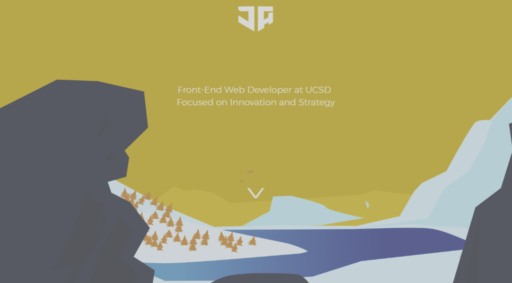

#Introduction to Web Application Development
##Personal Portfolio Site

##LEVEL: BEGINNER

##Required Downloads/Installation:

You will need a code editor to edit HTML files . You can edit in notepad if you like, but popular free ones with code highlighting, code completion and version control integration include:

Sublime:				[https://www.sublimetext.com/3](https://www.sublimetext.com/3) (nags you but still is free)
Atom: 					[https://atom.io/](https://atom.io/)
Brackets: 				[http://brackets.io/](http://brackets.io/)
Visual Studio Code: 	[https://code.visualstudio.com/](https://code.visualstudio.com/)

With any of these editors, save your files with a *.html extension so they can be opened in a web browser.

##Purpose of this Project:
* Build Technical Knowledge with an opinionated way of learning
* Teach Core Fundamental Coding Concepts while ensuring good practices
* Teach the necessary skills to ensure a smooth navigation and learning of the web stack
* Teach students how to use Libraries and available tools to speed up development
* Understand How the internet works, and how it interweaves with web development

## Learning Objectives:

##Skills Learned:
* HTML/ CSS/ 
* Vanilla Javascript
* Jquery/ BootStrap

## 

Understand how the web works
Purpose:
Learning Objectives:  (Rename)

Skills Learned:

Questions To
HTML/ CSS
- Basic Tags
- What it is (nodes), How it works
- CSS - Tips (And references)
- 3 exercises ------------------->
1. Create a mini-blog
  Extra: With Color & Nice Font
2. Fun with Links
3. Attempt to Create something given a picture

    CSS
      Positioning
      Margin, Padding, Border, Common Pitfalls [Less headaches]
      Font

      classes vs ids

Pure Javascript
- Loops & Conditionals
- Variables
- Debuggng/ Accessing Dom
- 3 exercises ------------------->

1.
2.
3. Create a mini-web app
BootStrap

Server - Stuff?

Portfolio
- Design & Prototype
-
